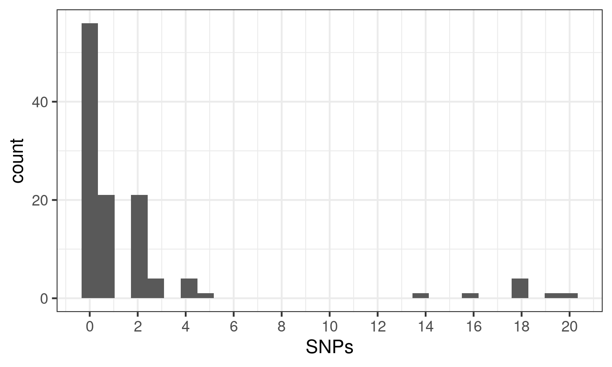
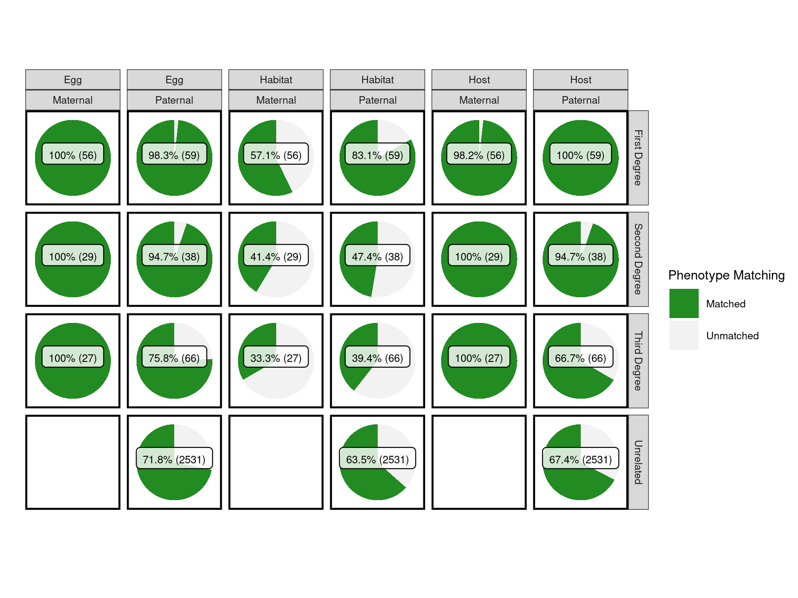
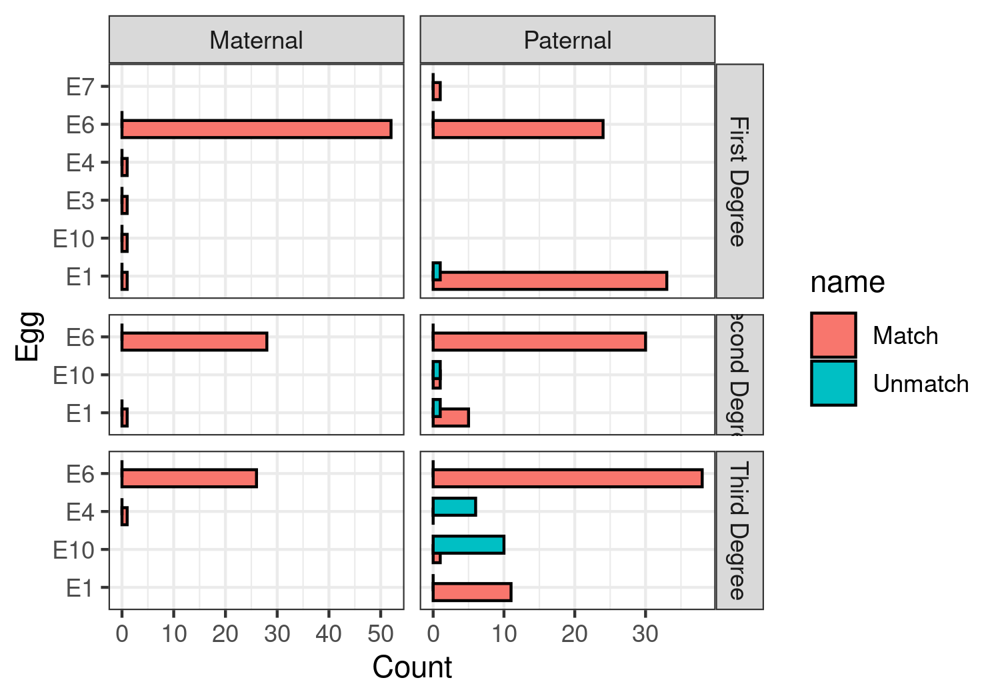

# Relatedness among C. canorus

Relatedness was assessed with the KING coefficient among n=299 individuals from all autosomal chromosomes. To reduce computational burder we estimated relatedness on an LD-pruned (`50 5 0.1`) MAF5% filtered dataset, removing SNPs grossly out of HWE which are typically genotyping errors (`hwe 1e-10`). 

## `01_Estimate_KING_IBS.sh`

```
#merge autosomes
bcftools concat --file-list Autosomes.list --threads 10 -Oz -o merged_full/autos.vcf.gz
bcftools index --threads 10 merged_full/autos.vcf.gz

#LD prune
~/modules/plink2 --threads 20 --vcf merged_full/autos.vcf.gz --keep Canorus_Samples_n300.list --allow-extra-chr --set-missing-var-ids @:# \
        --rm-dup --indep-pairwise 50 5 0.1 --maf 0.05 --hwe 1e-10 --max-alleles 2 --min-alleles 2 --out merged_full/autos_canorus_LD

#extract, also a vcf
~/modules/plink2 --threads 20 --vcf merged_full/autos.vcf.gz --keep Canorus_Samples_n300.list --allow-extra-chr --set-missing-var-ids @:# \
        --extract merged_full/autos_canorus_LD.prune.in \
        --make-bed --recode vcf bgz --pca --out merged_full/autos_canorus_LD
bcftools index --threads 5 merged_full/autos_canorus_LD.vcf.gz
sed -i 's/chr_//g' merged_full/autos_canorus_LD.bim

#calculate relatedness 
zcat merged_full/autos_canorus_LD.vcf.gz | sed 's/VCFv4.3/VCFv4.2/g' | vcftools --maf 0.05 --vcf - --relatedness2 --out merged_full/autos_canorus_LD
```

## `02_Count_mtDNA_Mutations.py`

Counting the number of mtDNA mutations between individuals. 

 

## `03_Assess_Relatives_Phenotypes.R`

Merge KING relatedness estimates with the mtDNA counts and define comparisons as maternal or paternal based on ZERO mtDNA SNPs. 

Also ensure

* Only comparisons within the same geographic group are considered (to reduce bias of egg-uniformity)
* Only cuckoo nestlings caught within 2 years of one another are considered (removing e.g. grandparents, aunt/uncle)


This leaves us with these comparisons:

| Relationship  | Line     | n    |
| ------------- | -------- | ---- |
| First_Degree  | Maternal | 56   |
| First_Degree  | Paternal | 59   |
| Second_Degree | Maternal | 29   |
| Second_Degree | Paternal | 38   |
| Third_Degree  | Maternal | 27   |
| Third_Degree  | Paternal | 66   |
| Unrelated     | NA       | 2531 |

Phenotype matching witin these categories:



Within each category, which egg types deviate (counts are found within `20250207_EggMismatch_Counts.txt`).



Fisher's exact test:

```
results <- df_agg %>%
  filter(Relationship != 'Unrelated') %>% 
  group_by(Relationship) %>%
  summarise(
    p_value = list(
      fisher.test(matrix(c(sum(Match[Line == "Maternal"]),
                           sum(Unmatch[Line == "Maternal"]),
                           sum(Match[Line == "Paternal"]),
                           sum(Unmatch[Line == "Paternal"])),
                         nrow = 2))$p.value
    )
  ) %>%
  unnest(p_value) %>% 
  mutate(padj = p.adjust(p_value,method='bonferroni'))
  ```

  | Relationship  | p_value | padj   |
| ------------- | ------- | ------ |
| First_Degree  | 1       | 1      |
| Second_Degree | 0.502   | 1      |
| Third_Degree  | 0.0046  | 0.0138 |


## Sensitivity

Differences in mtDNA SNP thresholds assessed between 0 - 3 SNPs for delineating maternal lines. Never observe a mismatch in maternal line across any (see pdfs). 
